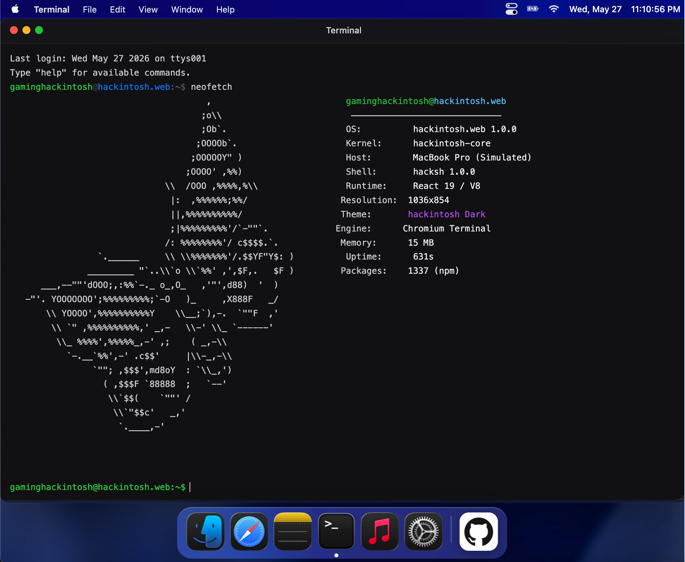
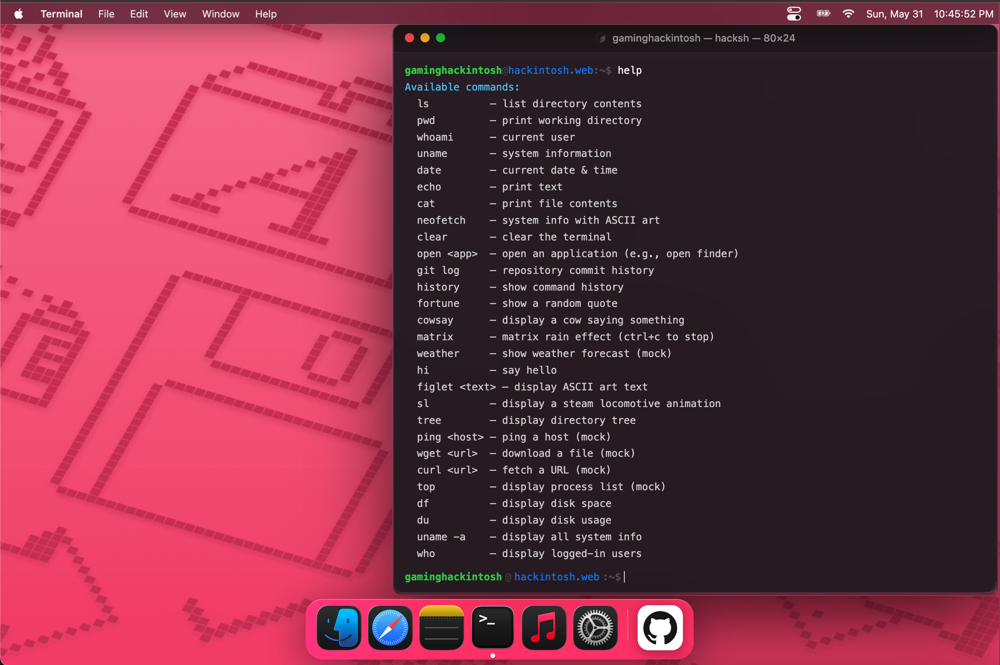

# hackintosh.web 🍎

> A web-native macOS experience — pixel-faithful, zero hardware required.

## 🌐 Live Demo

[https://gaminghackintosh.github.io/hackintosh.web/](https://gaminghackintosh.github.io/hackintosh.web/)

## 🌿 Repository Branches

| Branch | Purpose |
|---|---|
| `main` | Project overview & documentation |
| `code-root` | Main development branch |
| `gh-pages` | Production build deployed via GitHub Actions |

[](https://react.dev)
[](https://vitejs.dev)
[](https://sass-lang.com)
[](LICENSE)
[](https://github.com/gaminghackintosh)

---

## What is this?

**hackintosh.web** is an open-source macOS desktop environment that runs entirely in the browser. Built with **React 19**, it recreates the look, feel, and behavior of macOS — draggable windows, a magnifying Dock, a live Menu Bar, and real working apps — without touching a single line of Swift.

|  |  |
|----------------------------------------------------------------------------|-----------------------------------------------------------------------|

## ✨ Features

| Feature | Status |
|---|---|
| Menu Bar with live clock | ✅ Done |
| Dock with spring magnification | ✅ Done |
| Draggable windows (traffic lights & custom resize) | ✅ Done |
| Finder — advanced file browser with tabs, custom context menu & preview side-panel | ✅ Done |
| Terminal — working shell emulator with custom figlet support | ✅ Done |
| System Settings — fully-fledged control panel (Wi-Fi, Bluetooth, Network, Display panels) | ✅ Done |
| Music — Apple Music replica with custom track management, waveforms, and playback | ✅ Done |
| Notes — editable markdown-ish notes | ✅ Done |
| Desktop icons | ✅ Done |
| Dark / Light mode & Wallpaper toggle | ❌ Currently unavailable until the technical issues have been resolved |
| Safari browser | 🟡 02.06.2026 — It turned out to be possible... just not in the way you think. |
| App Store | ❌ Stop thinking that it’s possible 🫢 |
| Spotlight search (⌘ Space) | 🔲 Planned |
| Mission Control | 🔲 Planned |
| Notifications Center | 🔲 Planned |
| Calendar | 🔲 Planned |

---

## 🛠 Tech Stack

- **React 19** — component model & context-driven architecture
- **Vite 5** — lightning-fast dev server and bundler
- **SCSS / SASS (Modules & Globals)** — advanced architecture with deep glassmorphism mixins (`backdrop-filter`), native macOS cursor management, custom theme tokens, and semantic BEM styling

---

## 📁 Project Structure

You really thought this project had only 5 folders?

Good luck.

The actual structure is already evolving into a small operating system, and documenting every file here would probably require its own README.

If you're brave enough:

```bash
git checkout code-root
```

Then enter the rabbit hole yourself.

Or just open the repository and start scrolling until existential dread kicks in.

Current known ecosystem includes:

- Draggable and resizable window manager
- Native-like System Settings panels architecture
- Apple Music clone with complex playback tokens and rotation mechanics
- Fake Terminal emulator
- Finder clone with multi-tab support and persistent layouts
- Notes app
- Dock physics
- Live Menu Bar
- Responsive wallpaper renderer
- Custom OS-level cursor and hover system
- Several questionable architectural decisions at 3 AM

Happy exploring.

## 🎮 Terminal Commands

The built-in Terminal supports the following commands:

| Command | Description |
|---------|-------------|
| `help` | List available commands |
| `ls` | List directory contents |
| `pwd` | Print working directory |
| `whoami` | Display current user |
| `uname` | Show system information |
| `date` | Show current date & time |
| `echo [text]` | Print text to the terminal |
| `cat readme.md` | Print the contents of README file |
| `figlet [text]` | Display styled ASCII art text |
| `neofetch` | Show system information with ASCII art |
| `git log` | Display real commit history from GitHub |
| `clear` | Clear the terminal screen |


## 🤝 Contributing

PRs are welcome! If you want to add a new app or improve an existing one:

1. Fork the repo
2. Create a feature branch: `git checkout -b feat/my-app`
3. Add your app under `src/apps/` (and styles under `src/styles/apps/`)
4. Register it in `src/constants/apps.js`
5. Open a PR

---

**Made with ☕ and too many hours by [@ghost](https://github.com/gaminghackintosh)**
